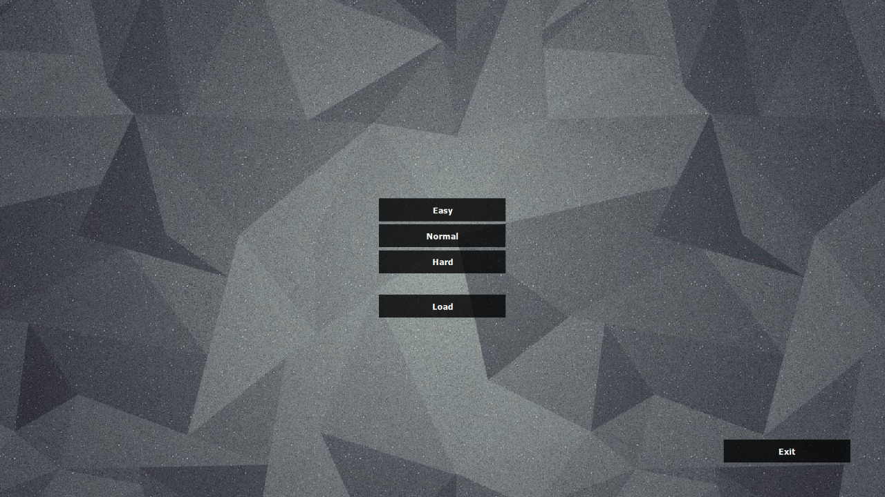
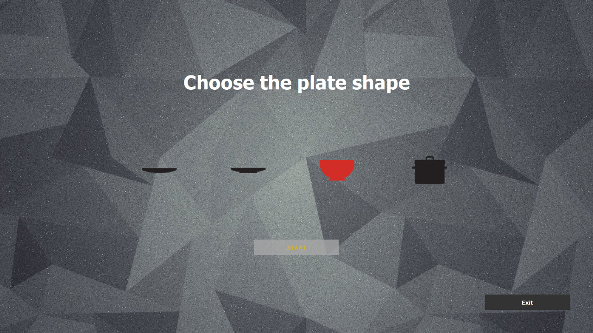
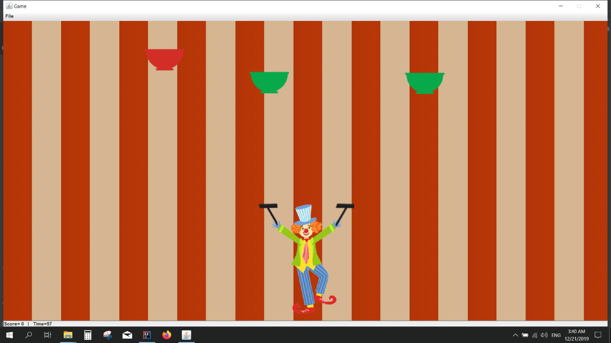
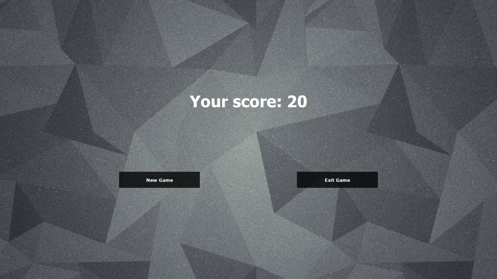

# Circus of Plates
Swing game in which you play with a clown trying to catch as many as possible 3 consecutive plates of the same color on the 
same stick regardless of their shape till the time ends.
## Design Patterns used
1. Singleton
2. Abstract Factory
3. Object Pool
4. Iterator
5. Dynamic Linkage
6. Snapshot (Not completed)
7. Snapshot
8. Strategy
9. Flyweight
10. Observer
## Game Rules
- The score increases by 10 points for every plate which makes it 30 point total for each collection.
- The score decreases by 10 points for each plate the user drops in condition that the score never gets below zero.
- Game overs if the timer reaches zero or the plates on either of the sticks reach the maximum height.
## Report contains
- Design Description
- Class Diagram
- Sequence Diagram
- Further details about usage of each design pattern with UML diagrams
## Screenshots

